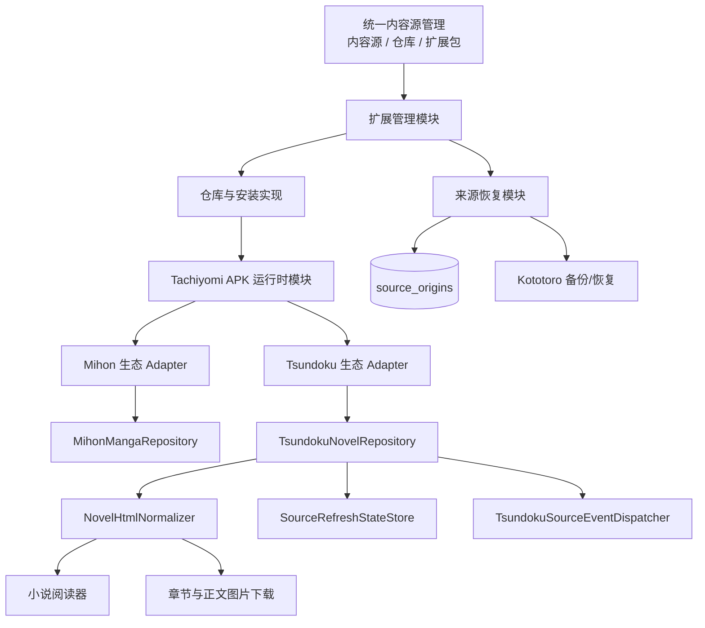
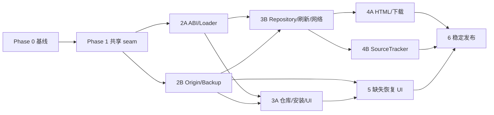

# Tsundoku / NovelSourcery 小说扩展集成实施计划（2026-08）

## 文档信息

- 状态：已完成需求决策，待实施
- 创建日期：2026-08-23
- 目标版本：稳定功能，不使用实验开关
- 兼容范围：NovelSourcery/Tsundoku Kotlin 小说 APK，`extensions-lib` 1.4 与 1.6
- 预计投入：30～42 人日，另留 10% 二进制兼容风险缓冲
- 发布硬约束：不得改变现有 Mihon、Aniyomi、IReader、Cloudstream、Tsuki、Legado、TVBox、JS、JAR
  等来源的身份、配置、安装或运行语义
- 关联文档：
  - [外部扩展集成指南](./external-extension-integration-guide.md)
  - [Mihon 集成参考](../reference/mihon-integration.md)
  - [统一源管理](../unified_source_management.md)
  - [Compose 小说阅读器兼容矩阵](../development/compose-novel-reader-parity-matrix.md)

## 1. 执行摘要

本计划把 Tsundoku 作为独立的一等小说扩展生态接入 Kototoro，而不是把它伪装成 Mihon 漫画源。

最终身份必须保持：

```text
MIHON_{sourceId}      -> Mihon 漫画源
TSUNDOKU_{sourceId}   -> Tsundoku 小说源
```

Mihon 与 Tsundoku 共享 APK 扫描、ClassLoader、宿主 ABI、网络桥接、安装生命周期等运行时实现，
但拥有独立的生态识别、来源包装、内容类型、仓库、配置命名空间和备份身份。

本次工作还补齐一项所有动态来源共用的基础能力：Kototoro 恢复备份后，即使原来源尚未安装，
作品、进度和小说类型仍会被保留，并能在统一内容源管理的“扩展包”页签中完成恢复、侧载、重新导入或迁移。

## 2. 已确认范围

### 2.1 必须实现

- 严格识别 `tachiyomi.novelextension` 及对应小说 metadata，不通过包名猜测生态。
- 精确支持 ABI 1.4、1.6；1.3、1.5、1.7 及未知版本均展示为不兼容。
- 支持单源类与 `SourceFactory`，并对工厂返回的每个对象严格验证小说接口。
- 支持系统 APK、Kototoro 私有 APK、文件侧载、安装、更新、显式降级、卸载和重新安装。
- 系统与私有 APK 同时存在时，版本高者优先；版本相同则系统 APK 优先。
- NovelSourcery 只进入推荐仓库列表，不静默写入用户仓库；允许添加第三方协议兼容仓库。
- 支持 `ConfigurableSource`、源账号、域名、UA、镜像及其他源设置。
- 复用现有 Cookie、OkHttp、Cloudflare、WebView 登录和请求头能力。
- 支持纯文本、安全 HTML、基础格式、正文图片、相对 URL、在线阅读和完整离线阅读。
- 支持 `RefreshContext` 的真实本地章节、最近成功刷新时间和强制刷新标志。
- 支持 `SourceTracker` 把阅读/收藏事件同步回来源网站；失败不得回滚本地状态。
- Kototoro 自身备份保存来源身份、仓库、配置及恢复提示元数据，但不保存 APK、不自动下载 APK。
- 所有源类型共用长期“缺失来源”恢复能力。
- 完成稳定版全矩阵验证，并把现有来源零回归作为发布阻断条件。

### 2.2 明确不做

- 不兼容 Tsundoku 应用备份。
- 不支持 Tsundoku 的 JS/custom-source 体系。
- 不维护或修复 NovelSourcery 中单个网站解析器。
- 不跨 Mihon/Tsundoku 自动合并作品。
- 不根据标题、包名或相似 source ID 猜测迁移；只接受显式上游映射或用户迁移。
- 不执行正文脚本、表单和复杂 CSS。
- 不新增“扩展包禁用”状态；保留现有逐源启停与包卸载。
- 不为所有非 APK 格式建立新的统一签名体系。
- 不宣称兼容完整 Tsundoku 应用；产品文案必须使用
  “Tsundoku/NovelSourcery Kotlin 小说扩展兼容（extensions-lib 1.4/1.6）”。

## 3. 领域语言

以下术语是本计划和后续代码评审的统一语言。

**来源生态（Source ecosystem）**：
扩展的协议、宿主 ABI 和身份规则集合，例如 Mihon 或 Tsundoku。生态不是内容类型。

**扩展包（Extension package）**：
承载一个或多个来源实现的 APK、JAR 或脚本包。扩展包可以不存在，但其来源数据仍可存在。

**来源（Content source）**：
Kototoro 用于浏览和读取内容的逻辑提供者，由稳定 `sourceKey` 唯一识别。

**来源身份（Source identity）**：
生态与上游 source ID 的严格组合。显示名、包名和仓库地址都不是来源身份。

**来源出处（Source origin）**：
用于恢复来源的长期元数据，包括生态、包名、源 ID、显示名、仓库和最近已见版本。

**缺失来源（Missing source）**：
仍被作品或配置引用、但当前运行时无法严格解析的来源。缺失是派生状态，不是永久标记。

**来源网站同步（Source tracking）**：
由扩展把已读或收藏状态同步回原小说网站。它不同于 Kototoro 对 AniList/MAL 等独立追踪平台的支持。

## 4. 当前实现与差距

### 4.1 Mihon 运行时可复用，但不能直接承载 Tsundoku

- `mihon/MihonExtensionLoader.kt` 同时承担扫描、识别、ABI、ClassLoader、反射构造和结果组装。
- `mihon/MihonExtensionManager.kt` 已经复用 `ExternalExtensionManagerFacade`，说明 manager 编排 seam 已存在。
- `mihon/util/ChildFirstClassLoaderPolicy.kt` 把 `eu.kanade.tachiyomi.source.*` 强制交给宿主；
  宿主当前没有完整的小说 ABI，因此直接加载会产生 `NoClassDefFoundError`、`AbstractMethodError` 或
  `NoSuchMethodError`。
- 当前系统/私有候选用列表顺序去重，实际总是系统包优先，不符合 Tsundoku 的版本选择规则。
- Mihon 仍保留 feature、metadata、包名的宽松兼容识别；该行为必须原样保留，不能因 Tsundoku 严格识别而改变。

### 4.2 Mihon 被硬编码为漫画

主要落点包括：

- `mihon/model/MihonMangaSource.kt` 固定漫画内容类型和 `MIHON_` 身份。
- `core/model/ContentSource.kt` 对 `MIHON_` 匿名来源回退为漫画。
- `explore/data/ContentSourcesRepository.kt`、`core/jsonsource/SourceTypeIdentifier.kt`、
  `core/parser/MihonContentSourceResolver.kt` 直接识别 `MIHON_`。
- `core/ui/compose/ContentSourceUi.kt` 按前缀解析图标和 manager。
- `backups/external/ExternalBackupDecoder.kt` 把 Mihon 外部备份写成漫画来源。
- `backups/external/MihonBackupExportRepository.kt` 和 `AniyomiBackupExportRepository.kt`
  直接筛选 `MIHON_`。

因此不能把 Tsundoku 包装成 `MihonMangaSource`，也不能复用 `MIHON_` 前缀。

### 4.3 仓库与安装框架接近可用

- `extensions/repo/ExtensionRepoService.kt` 已支持 JSON、protobuf、gzip、外部列表和 `jarUrl`。
- `extensions/repo/MihonExtensionStoreIndex.kt` 与 NovelSourcery protobuf 大部分字段兼容，
  但命名仍绑定 Mihon，且尚未显式建模 novel 字段。
- `extensions/install/ExtensionInstallService.kt` 已支持下载、私有 APK 和系统安装。
- `extensions/install/ExtensionInstallPolicy.kt` 与 `AppSettings.extensionInstallPolicies`
  已支持“每次询问 / 仅安装 / 安装并启用”。
- 统一管理已经有“内容源 / 仓库 / 扩展包”三个页签，不需要新建 Tsundoku 管理页面。

### 4.4 小说正文链路存在宿主级缺口

- `CachingContentRepository` 当前会在进入具体详情实现前丢失 `FORCE_REFRESH`，无法正确构造
  `RefreshContext.forceRefresh`。
- 当前没有语义可靠的“最近成功刷新时间”持久状态。
- `reader/novel/NovelContentLoader.kt` 的 HTML 处理仍以正则为主，不足以成为安全边界，且会丢失基础格式。
- `download/DownloadWorker.kt` 已允许单张正文图片失败而不终止整章，但没有完整处理相对 URL、源请求头、
  失败元数据和单图重试。
- `mihon/SourceRequestContext.kt` 硬依赖 `MihonMangaSource`，Tsundoku 无法直接复用浏览器 origin 上下文。

### 4.5 备份尚不能长期表达缺失来源

- `SourceBackup` 只保存 key、启用、排序和固定状态，且当前只导出 enabled 来源。
- `ContentBackup` 已保存精确 source 和 `content_type`，可以保住 `TSUNDOKU_` 与小说类型。
- 现有仓库备份可以承载新增 `ExternalExtensionType.TSUNDOKU`。
- 统一 catalog 只根据当前运行时来源和仓库包生成列表，无法显示“备份存在但扩展未安装”的虚拟恢复项。
- 恢复通知目前不能深链到扩展包页签的缺失筛选。

## 5. 目标架构



设计目标是形成深模块：调用者只需要认识小型接口，扫描、候选选择、ClassLoader、ABI、错误隔离、
HTML 安全、恢复状态等复杂性全部留在实现内部。

## 6. 模块与接口设计

### 6.1 Tachiyomi APK 运行时模块

建议目录：`extensions/runtime/tachiyomi/`。

外部 interface 只暴露：

- 观察当前扩展包和来源快照；
- 按严格 `SourceIdentity` 解析已加载来源；
- 因安装、卸载或包广播触发 reload；
- 返回结构化加载结果与诊断。

核心内部类型：

```kotlin
data class TachiyomiApkEcosystemSpec(
    val extensionType: ExternalExtensionType,
    val ecosystemDir: String,
    val sourcePrefix: String,
    val requiredFeature: String,
    val sourceMetadataKey: String,
    val factoryMetadataKey: String?,
    val acceptedLibVersions: Set<String>,
)

data class ExternalApkPackageKey(
    val ecosystem: ExternalExtensionType,
    val packageName: String,
)
```

内部实现包括：

- `ExternalApkCandidateResolver`：版本降序，同版本系统优先；
- `TachiyomiApkLoaderRuntime`：扫描、metadata、ABI、load path、ClassLoader 和结构化错误；
- `ExtensionInstanceAdapter`：direct/factory 结果验证和返回后逐源错误隔离；
- 生态 Adapter：保留 Mihon 宽松规则，Tsundoku 使用严格规则。

删除测试：如果删除该模块，扫描、候选选择、ClassLoader 和错误处理会重新散落到 Mihon/Tsundoku，
说明该 seam 具有真实深度。

### 6.2 共享来源 Adapter 与请求上下文

新增生态中性的 `TachiyomiXSourceAdapter`，至少携带：

- ecosystem；
- packageName；
- sourceId；
- 上游 `Source`；
- 内容类型；
- 请求 origin 与源级偏好命名空间。

`SourceRequestContext`、网络 client、Cookie/WebView 桥接依赖该 interface，不能继续硬转
`MihonMangaSource`。

配置隔离规则：

```text
preferences: ecosystem + packageName + sourceId
cookies:     domain（可跨生态共享）
source key:  ecosystem prefix + sourceId
```

### 6.3 Tsundoku ABI 与来源 Adapter

建议目录：`tsundoku/compat/` 与 `tsundoku/`。

- 宿主提供与二进制完全匹配的 `NovelSource`、`RefreshContext`、`SourceTracker`。
- 使用真实 1.4/1.6 fixture 验证同 FQCN 的兼容行为，不用反射猜测方法是否存在。
- `TsundokuNovelSource.name = "TSUNDOKU_${sourceId}"`。
- 每个已返回对象必须满足小说契约；不满足则记录源级错误并保留同包合法源。
- `SourceFactory.createSources()` 自身抛错时只能判整包失败，不能宣称可隔离尚未返回的单个构造异常。

### 6.4 Tsundoku 小说仓库

建议 `TsundokuNovelRepository` 复用 Mihon 列表、详情、章节、过滤器和请求头转换实现，差异集中在：

- 内容类型固定为小说或成人小说；
- 详情刷新构造真实 `RefreshContext`；
- 正文通过 `getPageList` 与 `fetchPageText` 获取；
- 正文进入统一 `NovelHtmlNormalizer`，不直接构造 data URL；
- 正文请求最终 URL 作为相对资源的 base URI。

### 6.5 小说 HTML 安全模块

建议目录：`reader/novel/content/`。

`NovelHtmlNormalizer` 是在线阅读和下载共同经过的唯一安全 seam。

允许：

- `p`、`br`、标题、`em`、`strong`、`blockquote`、列表及 `img`；
- HTTP/HTTPS 图片；
- 受大小与 MIME 限制的 `data:image`；
- 规范化后的宿主本地图片 URI。

拒绝：

- `script`、`form`、iframe、事件属性、危险 style；
- `javascript:`、来源提供的 `file:`/`content:` URI；
- 超出限制的 data URI。

输出应包含规范化 HTML、纯文本回退、已解析图片及每张图片的请求头/失败身份，而不只是字符串。

### 6.6 刷新状态模块

`RefreshContext` 需要真实 `mangaId`、现存章节、最近成功时间和强制刷新。

实施方案：

- 让 `FetchMode` 到达具体详情实现，不在缓存装饰层丢失；
- 新增 `source_refresh_state` 持久状态，key 为 ecosystem/source/content；
- 只有详情与章节刷新整体成功后才推进 `last_success_at`；
- 失败、取消和部分解析失败不推进；
- 该状态只用于优化，不进入用户备份，恢复后可以从零开始。

### 6.7 来源网站同步模块

新增 `TsundokuSourceEventDispatcher`，在本地数据库事务成功提交之后接收：

- 章节已读/未读；
- 加入/移出书架；
- 当前全部章节状态；
- 当前分类名称。

约束：

- 检查 `supportsChapterTracking`、`supportsFavoritesTracking` 和扩展自身设置；
- 使用监督式后台执行或持久队列，按 source/content 串行，允许折叠为最新状态；
- 网站失败、超时和扩展异常只产生结构化诊断，不回滚本地操作；
- 日志不记录 Cookie、账号、正文、完整 URL 查询参数等敏感信息；
- 不与 Kototoro 内置追踪平台共享状态机。

### 6.8 来源恢复模块

新增 `source_origins`，它是长期出处注册表，不是一次性 missing 表。

建议字段：

| 字段 | 用途 |
| --- | --- |
| `source_key` | 主键，严格来源身份 |
| `kind` | 稳定字符串；未知值保留为 UNKNOWN |
| `display_name` / `content_type` | 缺失时仍可展示正确类型 |
| `package_name` / `source_id` | APK/JAR 等包内身份 |
| `repository_url` / `repository_name` | 恢复原仓库 |
| `locator` | 非扩展来源的 URL/文件/导入定位符 |
| `version_name` / `version_code` | 恢复提示，不强制回装旧版本 |
| `signing_digest` | 最近已见签名，只用于换签关联确认 |
| `last_seen_at` / `updated_at` | 生命周期审计 |

`isMissing` 不落库。`SourceRecoveryRepository` 用 origin、运行时快照和作品引用实时派生：

- `RESOLVED`；
- `MISSING`；
- `REPOSITORY_REQUIRED`；
- `SIDELOAD_REQUIRED`；
- `REIMPORT_REQUIRED`；
- `SIGNATURE_CONFIRMATION_REQUIRED`。

卸载扩展不删除 origin。安装、导入或迁移后，状态自动变为 resolved，但 origin 继续保留，以支持二次卸载。

## 7. 数据、身份和兼容规则

### 7.1 严格身份

- Tsundoku 永远使用 `TSUNDOKU_{sourceId}`。
- 不修改现有 `MIHON_`、`ANIYOMI_`、`IREADER_` 身份。
- 统一 catalog 的包 key 从单独 packageName 改为 `(ecosystem, normalizedPackageName)`。
- 同名、同包名、相似 ID 都不能跨生态自动关联。
- 只有显式上游映射或用户发起的迁移可以改变来源身份。

### 7.2 APK 识别

- 只声明 novel feature：进入 Tsundoku 分类器。
- 只声明 manga feature：维持 Mihon 分类。
- 同时声明 manga 与 novel feature：`AMBIGUOUS`，拒绝加载。
- 只靠包名、类名或普通 Mihon metadata：不得猜成 Tsundoku。
- 工厂返回非 novel 对象：拒绝该对象，保留其他合法对象。

### 7.3 系统/私有候选

```text
versionCode 高者优先
versionCode 相同 -> SYSTEM 优先
```

该规则先只应用于 Tsundoku。Mihon 当前候选语义通过 characterization tests 固定，除非另立迁移任务，
本计划不顺手改变它。

### 7.4 更新、降级和签名

- 自动更新：同包名、当前签名匹配、versionCode 更高。
- 自动更新永不降级，切换仓库不静默接管。
- 自动更新默认只选择稳定版本。仓库有显式 channel 时必须为 stable；没有 channel 时，
  `versionName` 含 alpha、beta、rc、nightly、dev、snapshot 等预发布标记的版本只允许用户手动选择。
- 手动降级：用户明确选择目标版本并确认，当前包仍安装时必须同签名。
- 系统 APK 覆盖由 Android 签名校验兜底；Kototoro 不建立永久 APK 所有权。
- 包已卸载后允许安装不同签名分支。
- 如果旧数据仍存在且签名变化，不自动关联；用户确认后更新 origin 的最近签名并重新关联。
- 自动恢复永远不跨签名。
- IReader 保持当前签名行为，不在本期加永久绑定。

### 7.5 NSFW

仓库、APK metadata 和运行时声明采用最严格 OR：任一层判定成人即视为成人来源。

## 8. 备份格式与数据库迁移

### 8.1 Room 77 → 78

新增：

- `SourceOriginEntity` / DAO / 索引；
- `SourceRefreshStateEntity` / DAO；
- `Migration77To78`；
- Room schema 78。

迁移要求：

- 只对已知稳定前缀保守生成最小 origin；
- 未知 source key 原样保留，不猜生态；
- 不修改已有作品 source 和 content type；
- 迁移测试必须从 schema 77 真正升级到 78。

### 8.2 Kototoro 备份 schema 3 → 4

新增可选 `SOURCE_ORIGINS` 节和 `SourceOriginBackup`。

- 新备份导出所有 origin，不依赖来源是否 enabled。
- 导出前从已安装 catalog 和被作品引用的 source materialize 最小 origin。
- 不保存 APK 文件。
- MERGE 按 `source_key` upsert。
- SNAPSHOT_REPLACE 只替换该节，不误删作品。
- checkpoint、中断续传、WebDAV、周期恢复与系统 AppBackupAgent 全部走同一 reconcile。
- 旧备份没有 origin 节时仍成功恢复；已注册的稳定前缀恢复为已知 kind，只有未注册前缀生成 UNKNOWN
  最小记录。包名和仓库无法严格推出时保持空值，不能猜测。
- Mihon/其他应用外部备份格式不包含该节，也不把 Tsundoku 导出为 Mihon 数据。

## 9. 统一管理与恢复体验

不新增独立页面或第四个页签。

统一内容源管理继续使用：

```text
内容源 | 仓库 | 扩展包
```

“扩展包”页签增加：

- `MISSING` 与 `SIGNATURE_CONFIRMATION_REQUIRED` 状态；
- “待恢复 N”摘要；
- ALL/MISSING 筛选；
- 来源恢复分组，允许承载非 APK 来源；
- 可信仓库安装、添加原仓库、侧载、重新扫描、重新导入和迁移动作。

入口：

- 恢复结果通知：直接打开扩展包页签 + MISSING 筛选；
- 缺失来源作品错误页：携带 sourceKey 深链；
- 设置中的原“内容源与扩展管理”：显示待恢复数量角标；
- 不创建平行设置项。

仓库失效或不受信任时只保留记录，引导用户添加可信仓库或侧载；不得从任意仓库按包名自动找替代品。

## 10. 工作流与文件所有权

允许多个开发者或智能体并行，但必须按以下所有权避免冲突。

| 工作流 | 主要所有权 | 不得直接修改 |
| --- | --- | --- |
| A 共享运行时 | `extensions/runtime/tachiyomi/`、`tsundoku/compat/`、Tsundoku loader/manager | Reader、Backup UI |
| B 小说内容 | Tsundoku repository、`reader/novel/content/`、正文下载适配 | Loader、统一源 catalog |
| C 扩展管理 | `extensions/repo/`、`extensions/install/`、统一源 package/repo/source 映射和 UI | Room/Backup repository |
| D 备份恢复 | Room entity/DAO/migration、`backups/`、`SourceRecoveryRepository` | Loader、正文处理 |
| E 验证集成 | fixtures、测试、发布矩阵、文档 | 生产实现，除非回交给对应负责人 |

共享文件必须指定单一 owner：

- `UnifiedSourceModels.kt`、`UnifiedSourceCatalogRepository.kt`、`UnifiedSourcesViewModel.kt`：C；
- `MangaDatabase.kt`、`BackupRepository.kt`：D；
- `ContentSource.kt` 与来源类型路由：A；
- `DownloadWorker.kt`：B；
- `app/build.gradle`、Manifest 和 Hilt 注册：由集成人统一落地，不允许多工作流并行编辑。

## 11. 分阶段实施计划

所有阶段遵循 red → green → refactor。先提交 characterization/contract tests，再提交生产实现。

### Phase 0：基线、fixture 与发布门禁（1.5～2.5 人日）

负责人：E；A/B/C/D 参与确认。

任务：

- T0.1 固定当前 Mihon 扫描、ID、内容类型、候选选择、仓库、安装策略、签名、卸载和热重载行为。
- T0.2 保存裁剪后的 NovelSourcery protobuf fixture，覆盖字段 8000、未知字段、相对/绝对资源 URL。
- T0.3 建立 1.4 single、1.4 factory、1.6 suspend 测试 APK/fixture；不得让测试依赖在线仓库。
- T0.4 建立现有小说在线/下载/离线、Cookie/WebView 和备份恢复基线。
- T0.5 记录现有关键测试与构建耗时，建立稳定发布 checklist。

完成门槛：所有 fixture 可离线运行；Mihon characterization tests 全绿。

### Phase 1：共享 seam 与身份模型（3～4 人日）

负责人：A；C 配合包 key，D 配合 origin schema。

任务：

- T1.1 引入 `ExternalApkPackageKey`、`SourceIdentity`、生态中性来源 Adapter。
- T1.2 抽取候选 resolver、ClassLoader policy 和 Tachiyomi APK loader runtime。
- T1.3 Mihon 通过 Adapter 接回共享 runtime，但保留全部原行为。
- T1.4 把请求上下文从 `MihonMangaSource` 泛化到共享 interface。
- T1.5 增加 `ExternalExtensionType.TSUNDOKU`、`UnifiedSourceKind.TSUNDOKU` 的编译骨架。

完成门槛：Tsundoku 尚未可用，但 Mihon 全部基线测试无变化；共享 runtime 的 interface 成为后续唯一 seam。

### Phase 2A：Tsundoku ABI、加载器与 manager（3～4.5 人日）

负责人：A。依赖 Phase 1。

任务：

- T2A.1 实现二进制兼容的 1.4/1.6 NovelSource、RefreshContext、SourceTracker 宿主 ABI。
- T2A.2 实现严格 APK 分类器、双 feature 歧义拒绝和精确 ABI 白名单。
- T2A.3 实现 direct/factory 加载、返回后逐源验证、重复 source ID 诊断。
- T2A.4 实现系统/私有版本选择和包广播 reload。
- T2A.5 实现 `TsundokuExtensionManager` 与 `TSUNDOKU_` 解析。

完成门槛：三类 fixture 均能离线加载；非法 ABI、漫画对象、双 feature 均产生正确结构化错误。

### Phase 2B：来源出处与备份数据基础（3～4 人日，可与 2A 并行）

负责人：D。依赖 Phase 1 的身份模型，不依赖 Tsundoku loader 完成。

任务：

- T2B.1 添加 Room 78 的 origin/refresh state 表与迁移测试。
- T2B.2 实现 `SourceRecoveryRepository` 的严格派生状态。
- T2B.3 新增 backup schema 4、SOURCE_ORIGINS round-trip 和旧备份回退。
- T2B.4 接入 checkpoint、MERGE、SNAPSHOT_REPLACE 和各恢复通道 reconcile。

完成门槛：卸载扩展后 origin 仍存在；旧备份可恢复为 UNKNOWN 缺失来源；无标题/包名猜测关联。

### Phase 3A：仓库、安装和统一管理（4～5.5 人日）

负责人：C。依赖 Phase 2A 提供 manager 快照，并依赖 Phase 2B 提供 origin interface。

任务：

- T3A.1 中性化 protobuf 模型并支持 NovelSourcery/第三方兼容仓库。
- T3A.2 将 NovelSourcery 加入推荐列表，但保持未配置状态。
- T3A.3 接入私有/system/文件侧载、安装、更新、手动降级、卸载、重装和 reload。
- T3A.3a 自动更新只选稳定 channel；预发布版本只能由用户明确选择，第三方仓库缺 channel 时按预发布
  版本标记保守判断。
- T3A.4 把 catalog、下载状态和 installed 合并 key 改为 ecosystem + package。
- T3A.5 接入安装启用三态、逐源启停、图标、文案、过滤器和 NSFW。
- T3A.6 同步仍可达的旧扩展入口，或明确关闭重复入口，避免两套 UI 能力不一致。
- T3A.7 安装成功与扫描成功时 upsert origin；卸载时不删除 origin。

完成门槛：完整包生命周期可用；同包跨生态不碰撞；推荐仓库不自动添加；第三方协议兼容仓库可手动添加。

### Phase 3B：小说 repository、刷新与网络（4～6 人日，可与 3A 后半并行）

负责人：B。依赖 Phase 2A，并依赖 Phase 2B 提供 refresh state interface。

任务：

- T3B.1 实现 `TsundokuNovelSource` 与 `TsundokuNovelRepository`。
- T3B.2 复用列表、详情、章节、过滤器、headers、Cookie、CF/WebView 行为。
- T3B.3 修复 FetchMode 传递并构造真实 RefreshContext。
- T3B.4 成功刷新后更新 refresh state；失败与取消不更新。
- T3B.5 隔离偏好命名空间并验证域 Cookie 共享。
- T3B.5a 完整接入 `ConfigurableSource` 设置页、账号/域名/UA/镜像/选项的读写，并验证重装后恢复。
- T3B.6 完成 host/provider 错误分类、脱敏日志和可复制诊断摘要。

完成门槛：1.4/1.6 均可浏览、搜索、打开详情与刷新章节；强制刷新和增量刷新语义可测试。

### Phase 4A：安全正文、图片和离线阅读（4～6 人日）

负责人：B。依赖 Phase 3B。

任务：

- T4A.1 实现 Jsoup safelist `NovelHtmlNormalizer`，取代正则作为安全边界。
- T4A.2 解析正文最终 URL、相对图片 URL 和源请求头。
- T4A.3 在线 reader 支持纯文本、格式、块/行内图片及失败占位。
- T4A.4 下载时保存规范化 HTML 与图片；单图失败不终止整章。
- T4A.5 保存失败图片元数据并实现单图重试与 HTML 映射更新。
- T4A.6 验证重启、断网和部分失败后的离线阅读。

完成门槛：恶意 HTML 被清理；离线不访问网络；图片补下后无需重下整章即可生效。

### Phase 4B：SourceTracker 网站同步（2～3.5 人日，可与 4A 并行）

负责人：B，D 协助事务后事件入口。

任务：

- T4B.1 在收藏和已读写入成功后产生统一事件，不从 UI ViewModel 直接调用扩展。
- T4B.2 实现 supports/设置检查、按内容串行和最新状态折叠。
- T4B.3 实现有限重试、超时、取消和错误诊断。
- T4B.4 验证事件失败不回滚本地数据库。

完成门槛：read/unread/favorite/unfavorite 四类事件均覆盖；设置关闭和 supports=false 时零网络副作用。

### Phase 5：缺失来源管理闭环（3.5～5 人日）

负责人：C 负责 UI，D 负责状态与动作协调。依赖 Phase 2B、3A。

任务：

- T5.1 扩展 package/recovery 状态、MISSING 筛选、摘要和恢复卡片。
- T5.2 增加 initialTab/packageFilter/sourceKey 深链和进程恢复。
- T5.3 恢复通知、作品错误页和设置角标接入统一入口。
- T5.4 实现可信仓库安装、预填添加仓库、APK 侧载、重新扫描、非 APK 重新导入。
- T5.5 复用现有 SourceMigration 工作流并预选受影响作品。
- T5.6 实现卸载后换签关联确认；自动恢复不跨签名。

完成门槛：每种缺失状态都有可执行下一步；解决后自动退出 missing；二次卸载仍能恢复 provenance。

### Phase 6：稳定版集成与发布（5～7 人日）

负责人：E；所有工作流修复各自缺陷。

任务：

- T6.1 执行第 13 节完整矩阵。
- T6.2 执行 Mihon、Aniyomi、IReader、Cloudstream、Tsuki、Legado、TVBox、JS、JAR 关键回归。
- T6.3 验证 Room 77→78、backup 3→4、旧备份和冷恢复。
- T6.4 验证系统/私有/侧载/更新/卸载/重装和包广播。
- T6.5 真机验证 Cookie、Cloudflare、WebView、正文图片、下载、离线、进程重建。
- T6.6 完成产品文案、故障归因说明和上游问题链接策略。
- T6.7 完成 debug/nightly/release 构建与 R8 验证。

完成门槛：全部阻断测试通过、无现有来源回归、无已知 P0/P1 缺陷，才可直接作为稳定功能发布。

## 12. 并行执行与关键路径



建议人员安排：

- 1 人：7～10 周；
- 2 人：5～7 周；
- 3 人：3.5～5 周；
- 4 人以上收益有限，Phase 1、共享 UI 文件和最终集成仍是串行瓶颈。

推荐三人配置：

- 工程师 A：Phase 0/1/2A/运行时集成；
- 工程师 B：Phase 3B/4A/4B；
- 工程师 C：Phase 2B/3A/5；
- Phase 6 共同执行，由一人统一集成。

## 13. 验证矩阵

### 13.1 ABI 与加载

- 1.4 single；
- 1.4 factory；
- 1.6 suspend；
- ABI 1.3/1.5/1.7/未知；
- only novel、only manga、双 feature、缺 metadata；
- factory 合法/非法混合、factory 整体异常、重复 source ID；
- 系统新于私有、私有新于系统、同版本系统优先；
- 外部应用已安装 APK 被发现；
- 安装/更新/卸载广播热重载。

### 13.2 仓库与生命周期

- NovelSourcery 推荐但未配置；
- 手动添加推荐仓库；
- 第三方 JSON/protobuf 协议兼容仓库；
- gzip、未知字段、字段 8000、相对/绝对 APK/icon URL；
- 多仓同包最高版本和确定性 tie-break；
- stable channel 自动更新；alpha/beta/rc/nightly/dev/snapshot 不被自动选择；用户手动选择预发布；
- 安装三态和逐源启停；
- 私有、系统、文件侧载；
- 同签名更新、当前包异签阻断、手动同签降级；
- 卸载保留数据、重装恢复；
- 跨生态同包名不合并。

### 13.3 网络、设置与刷新

- UA、自定义 headers、Referer；
- 域 Cookie 共享与源偏好隔离；
- WebView/Cloudflare 登录后 Cookie 回灌；
- 账号、域名、镜像、配置项；
- `ConfigurableSource` 设置页读写、生态/包/源隔离、卸载保留与重装恢复；
- existingChapters 顺序与字段映射；
- lastFetch 成功推进、失败不推进；
- FORCE_REFRESH true/false；
- provider 与 host 错误分类；
- 日志无 Cookie、token、密码和正文。

### 13.4 正文与离线

- 纯文本、基础格式、实体编码、超长正文；
- script/form/on*/javascript:/危险 CSS 清理；
- 相对图片、跨域 CDN、data image 限制；
- 图片 headers/Cookie/Referer；
- 在线块图片/行内图片；
- 单图 404、超时、取消；
- 部分失败仍完成章节；
- 单图重试；
- 重启后完整离线阅读；
- 离线模式零网络请求。

### 13.5 SourceTracker

- read、unread、favorite、unfavorite；
- supports=false；
- 源设置关闭；
- 分类名和全部章节上下文；
- 批量、非连续章节；
- 网络失败、超时、扩展异常；
- 本地提交不回滚；
- 重复事件和顺序控制。

### 13.6 备份与恢复

- Room 77→78；
- schema 4 round-trip；
- disabled source origin；
- 只被作品引用的来源；
- 旧备份没有 origin；
- 未知 kind/字段；
- MERGE、SNAPSHOT_REPLACE、checkpoint 续传；
- 手动/WebDAV/周期/AppBackupAgent；
- 扩展未安装、系统包外部卸载、工厂移除源、仓库失效、非扩展 locator 丢失；
- 安装/扫描后自动 resolved；
- 卸载后换签确认；
- 通知、作品错误和设置角标深链。

### 13.7 零回归

- Mihon ID、漫画类型、宽松识别和候选语义不变；
- Mihon 外部备份只包含 Mihon；
- Aniyomi 视频来源不受小说 ABI 影响；
- IReader 当前仓库和签名行为不变；
- Cloudstream runtime jar 与 WebView 行为不变；
- Tsuki runtime jar 与漫画解析不变；
- Legado/TVBox/JS/JAR 导入、启停、仓库和列表不变；
- 原生漫画、小说、视频及本地内容可正常浏览、下载和打开。

## 14. 验证命令

每个 Phase 至少执行其定向测试与编译；Phase 6 执行：

```bash
./gradlew :app:compileDebugKotlin
./gradlew :app:testDebugUnitTest --no-daemon
./gradlew :app:assembleDebug
./gradlew :app:assembleNightly
./gradlew :app:assembleRelease
./gradlew :app:connectedDebugAndroidTest
npm run docs:build
```

设备验证优先使用：

```bash
android describe --project_dir=.
android run --debug
android layout --pretty
android layout --diff
```

release 构建允许在无正式签名环境下验证 unsigned 产物，但 R8 和资源压缩必须完整通过。

## 15. 错误与可观测性

结构化错误至少区分：

- `HOST_ABI_INCOMPATIBLE`；
- `AMBIGUOUS_ECOSYSTEM`；
- `INVALID_MANIFEST`；
- `FACTORY_LOAD_FAILED`；
- `SOURCE_VALIDATION_FAILED`；
- `PROVIDER_HTTP_FAILED`；
- `PROVIDER_PARSE_FAILED`；
- `WEBVIEW_AUTH_FAILED`；
- `CONTENT_SANITIZATION_FAILED`；
- `INLINE_IMAGE_FAILED`；
- `SOURCE_TRACKING_FAILED`；
- `RECOVERY_SOURCE_MISSING`；
- `SIGNATURE_CONFIRMATION_REQUIRED`。

用户诊断摘要包含生态、包名、版本、ABI、源名/ID、失败阶段和上游仓库/问题地址，不包含敏感 header、Cookie、
账号、正文或完整查询参数。

## 16. 工作量与风险预算

| 子域 | 人日 |
| --- | ---: |
| 基线、fixture、身份与共享 seam | 5～7 |
| ABI、loader、manager、仓库与生命周期 | 8～11 |
| 小说 repository、网络、刷新、HTML、图片、离线、Tracker | 9～14 |
| 通用来源出处、备份与缺失恢复闭环 | 7～10 |
| 稳定版集成、真机与回归 | 5～7 |
| 重叠抵扣 | -4～-7 |
| **合计** | **30～42** |

重叠抵扣主要来自：Phase 1 的共享请求上下文同时服务 loader 与小说网络；Phase 2B 的同一次 Room 迁移
同时创建 origin 与 refresh state；Phase 3A 的统一 catalog 接入同时承担安装 lifecycle 与恢复卡片数据；
Phase 6 的构建、设备和现有来源回归覆盖所有子域，不在各子域重复计费。

另留 10% 风险缓冲，不直接承诺为功能开发时间。缓冲主要用于：

- 1.4/1.6 同 FQCN 二进制差异；
- 上游真实 APK 的 `AbstractMethodError`/`NoSuchMethodError`；
- factory 在返回列表前内部构造失败，无法逐源隔离；
- 旧扩展 UI 与统一管理双入口；
- 任意文件 APK 侧载的 manifest/签名预检；
- release R8 对动态反射类的保留规则。

## 17. 发布门槛与停止条件

稳定发布必须同时满足：

1. 第 13 节全部阻断矩阵通过；
2. Mihon 和其他既有来源无身份、内容类型、安装、仓库、备份或阅读回归；
3. Room 迁移和旧备份恢复可重复通过；
4. 真实 1.4/1.6 扩展完成设备冒烟；
5. 无跨生态包名/source ID 自动关联；
6. 正文安全清理和离线零网络经过自动化测试；
7. SourceTracker 失败不会破坏本地数据；
8. debug、nightly、release 构建通过。

出现以下任一情况必须阻断发布，而不是降级为稳定功能中的已知问题：

- 现有 Mihon 数据被解释为小说或进入错误备份；
- Tsundoku 数据进入 Mihon 外部备份；
- 未安装扩展导致恢复作品或内容类型丢失；
- 异签自动更新/自动恢复；
- 正文脚本或危险 URI 可执行；
- 离线章节仍依赖远程图片；
- 扩展网站同步失败回滚本地已读/收藏。

## 18. 建议提交与评审边界

建议每个 Phase 拆为独立、可回退提交：

1. `test(tsundoku): add ABI and Mihon regression fixtures`
2. `refactor(extensions): extract shared Tachiyomi APK runtime`
3. `feat(tsundoku): load NovelSourcery extension packages`
4. `feat(extensions): add Tsundoku repositories and lifecycle`
5. `feat(tsundoku): add novel repository and refresh context`
6. `feat(reader): normalize external novel HTML and offline images`
7. `feat(tsundoku): dispatch source website tracking events`
8. `feat(backup): persist source origins and missing source recovery`
9. `feat(sources): add missing source recovery workflow`
10. `test(tsundoku): complete stable release regression matrix`

每个主要 Phase 合入前使用 code review 同时检查：

- Standards：是否符合现有架构、KISS、DRY、SOLID 和测试规范；
- Spec：是否符合本文档及已确认产品决策。

## 19. 实施前最后检查清单

- [ ] 确认测试 fixture 的许可证和仓库存放方式；优先裁剪自建 fixture，不提交第三方完整 APK。
- [ ] 冻结 `SourceIdentity`、`ExternalApkPackageKey` 和 runtime interface。
- [ ] 指定共享文件 owner，禁止并行覆盖。
- [ ] 建立 Room schema 77 与 backup schema 3 的可重复基线。
- [ ] 确认旧扩展管理入口是否仍可达，决定同步支持或移除入口。
- [ ] 为手动 APK 侧载和显式降级确定统一 UI 动作。
- [ ] 准备至少一个需要 Cookie/WebView 的测试源和一个含正文图片的测试源。
- [ ] 把 Mihon 零回归矩阵加入 CI 阻断组。

完成上述检查后，从 Phase 0 开始；不得直接从 Tsundoku loader 编码起步。
